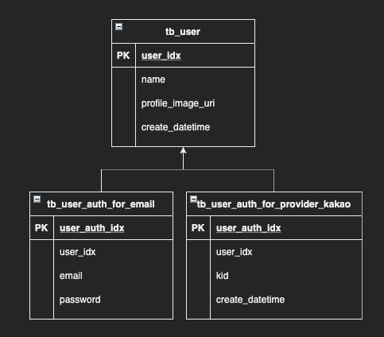

```yaml
하나의 유저 계정에 여러 로그인 방법 추가 설계 고민
```

요즘은 OAuth2를 이용하여 회원가입/로그인하는 서비스들이 매우 많아졌다.  
해당 방법으로 로그인을 하다 보면, 동일한 계정에 대해 구글계정으로 로그인 등 여러가지 추가 로그인 방법이 있으면 좋겠다고 생각이 들 때가 있고, 기존에 사용하던 연동된 계정을 사용하지 않게 되는 경우도 발생한다.  
따라서, 하나의 유저 계정에 여러개의 인증 방법으로 로그인 할 수 있는 방법에 대해 고민해보았고, 어떻게 해야할 지에 대해 기록한다.

내가 지금까지 만들었던 DB의 대부분은 유저정보가 곧 로그인 정보와 동일하였다.  
만약, 로그인을 이메일(아이디)/비밀번호로 사용하다가 OAuth2와 같은 로그인 방법이 추가되면, 테이블 구조와 코드가 더러워졌었다.  
하지만, 해당 방법 말고 유저 테이블과 로그인에 필요한 인증 테이블을 다르게 가지고 간다면, 해당 문제가 발생하지 않겠다라고 생각이 들었다.

해당 방법은 이전에 회사에서 퇴사하신 분과 토이프로젝트 작업을 할 때, 고민하다가 적용하였었다.  
테이블 구조는 아래와 같이 가진다.



위 이미지는 대략적으로 이런식으로 구현할 거라는 것만 그렸다.  
만약, 제공자가 구글인 인증방법이 추가된다면, 테이블을 하나 추가 시키면 된다.  
그리고 로그인 시, 입력되는 type에 따라, 인증방법을 달리하면 된다.

만약, 회원가입/로그인/인증코드 추가 Erlang 코드상에서 나타낸다면, 아래와 같은 코드가 나올 것이다.  
단, 예제를 위해 작성 하였고, 에러에 대한 대비 코드는 추가하지 않았다. 실제 코드를 실행해보지 않았다.  
실제로 작업한다면, 함수합성을 사용할 것이다.
### auth.erl
```Erlang
  ...
  -export_all().

  -spec sign_up(bitstring(), types:auth_type(), map()) -> 
    {ok, map()} 
    | {error, already_exist_auth_for_email}
    | {error, already_use_email}.
  sign_up(Name, Type, AuthData)->
    {ok, UserInfo} = model_user:insert(Name),
    {ok, AuthModule} = auth_plugin_utils:type_to_auth_module(Type),

    {ok, _} = AuthModule:new(UserInfo, AuthData),
    {ok, UserInfo}.

  -spec sign_in(types:auth_type(), map())->
    {ok, map()}
    | {erorr, invalid_auth_info}.
  sign_in(Type, AuthData)->
    {ok, AuthModule} = auth_plugin_utils:type_to_auth_module(Type),
    case
      AuthModule:get(Type, AuthData)
    of
      {ok, UserIdx}->
        {ok, UserInfo} = model_user:get_by_user_idx(UserIdx),
        {ok, UserInfo};
      {error, _} = Err->
        Err
    end.
  
  -spec add_auth(pos_integer(), types:auth_type(), map())->
    ok
    | {error, already_exist_auth_for_email}
    | {error, already_use_email}.
  add_auth(UserIdx, Type, AuthData)->
    {ok, UserInfo} = model_user:get_by_user_idx(UesrIdx),
    {ok, AuthModule} = auth_plugin_utils:type_to_auth_module(Type),

    case
      AuthModule:new(UserInfo, AuthData)
    of
      {ok, _} ->
        ok;
      {error, _} = Err->
        Err
    end.

    -spec withdraw(pos_integer()) -> ok.
    withdraw(UserIdx)->
      {ok, UserInfo} = model_user:get_by_user_idx(UesrIdx),
        [
          AuthModule:remove(UserInfo)
          || AuthModule <- auth_plugin:get_all_auth_modules()],
      model_user:delete_by_user_idx(UserIdx),
      ok.

  %%%
  %%% Internal Function
  %%%

  ...
```

### auth_plugin_for_email.erl
```Erlang

  -behavior(auth_plugin).
  -export_all().
  
  -spec new(UserInfo :: map(), AuthData :: map()) -> 
    {ok, map()}
    | {error, already_exist_auth_for_email}
    | {error, already_use_email}.
  new(#{uesr_idx := UesrIdx} = UserInfo, #{email := Email, password := Password} = _AuthData)->
    IsAlreadyHasAuth = 
      case
        model_auth_for_email:get_by_user_idx(UserIdx)
      of
        {ok, _}->
          true;
        {error, _}->
          false
      end,
    
    IsAlreadyUseEmail = 
      case
        model_auth_for_email:get_by_email(Email)
      of
        {ok, _}->
          true;
        {error, _}->
          false
      end,
      
    case
      {
        IsAlreadyHasAuth
        , IsAlreadyUseEmail
      }
    of
      {true, _} ->
        {error, already_exist_auth_for_email};
      {_, true} ->
        {error, already_use_email};
      {false, false} ->
        % 패스워드 암호화 과정 코드가 포함되어야 하지만, 여기에는 포함하지 않음.
        model_auth_for_email:insert(UserIdx, Email, Password)
    end.

  -spec get(AuthData :: map()) -> 
    {ok, pos_integer()}
    | {error, invalid_auth_info}.
  get(#{email := Email, password := Password} = _AuthData) ->
    case
      model_auth_for_email:get_by_email(Email)
    of
      {ok, AuthInfo} ->
        case
          maps:get(password, AuthInfo)
        of
          Password -> 
            {ok, maps:get(user_idx, AuthInfo)};
          _ ->
            {error, invalid_auth_info}
        end;
      {error, _} ->
        {error, invalid_auth_info}
    end.

  -spec remove(UserInfo :: map()) -> 
    {ok, any()}.
  remove(#{user_idx := UserIdx} = _UserInfo) ->
    model_auth_for_email:remove_by_user_idx(UserIdx).
```

### auth_plugin_utils.erl
```Erlang
  -export_all().

  type_to_auth_module(email)->
    {ok, auth_plugin:auth_plugin_for_email()};
  type_to_auth_module(Any)->
    io:format("{[ [~p:~p] invalid auth module! ~p ]} ~n", [?MODULE, ?FUNCTION_NAME, Any]),
    {error, invalid_auth_module}.

```

### auth_plugin.erl
```Erlang
  -export_all().

  auth_plugin_for_email()->
    ?FUNCTION_NAME().

  get_all_auth_modules()->
    [FunctionName || {FunctioName, _Arity}<- module_info(exports), FunctionName =/= module_info, FunctionName =/= get_all_auth_modules].
```

behavior는 Java로 치면 Interface같은 역할을 하는데, Erlang에서는 강제성을 띄지 않는다.  
위와 같은 방식을 사용하면, 새로운 로그인/회원가입 방법이 추가되면 아래 순서대로 진행하면 된다.
1. 로그인/회원가입 방법에 맞는 테이블 추가
1. 로그인/회원가입 방법에 맞는 plugin 파일을 추가 ( ex : auth_plugin_for_kakao)
1. auth_plugin.erl 파일로 가서 해당 모듈명에 해당하는 함수를 추가시킨다.
1. `auth_plugin_utils.erl`파일에서 `fun type_to_auth_module/1`에 `kakao`에 해당되는 패턴매칭을 추가시켜준다.

만약, 특정 방법으로 추가적인 회원가입/로그인을 막게 되면, 해당 plugin 내부에서 new/get function의 return으로 `{error, not_suppert}` 정도만 주면 될것이라 생각된다.

실제, 해당 방법이 적용된 프로젝트는 서버는 TypeScript + Express + TypeORM를 사용하였고, 클라이언트는 Flutter를 통해 작성하였다.  
개인적으로 재밌었는데, 서로 바빠지게 되면서, 추가적인 하지 못하게 되어 안타까운 토이 프로젝트였다.  
해당 코드는 추후, 개인 Github를 통해서 올릴 예정이다.